# WORKFLOW SCHEMA — **benchFlow**
### How we work, drawn out

> Companion to `CLAUDE.md`. Every diagram below is Mermaid — it renders automatically on
> GitHub, so this file is readable straight from the repository page.

---

## 1. THE SESSION LOOP
### The single most important diagram in this project

This is the cycle we repeat for every feature. **Nothing skips a step.**

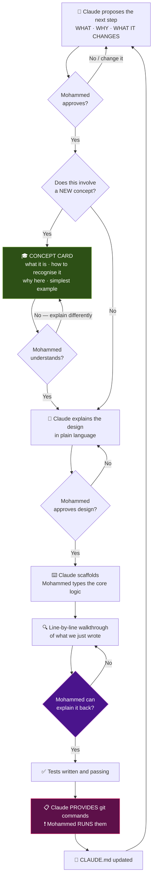

**The two red-flag gates:** the 🎓 Concept Card (never skipped) and the ❗ Git handover
(Claude *never* executes).

---

## 2. THE THREE HARD RULES

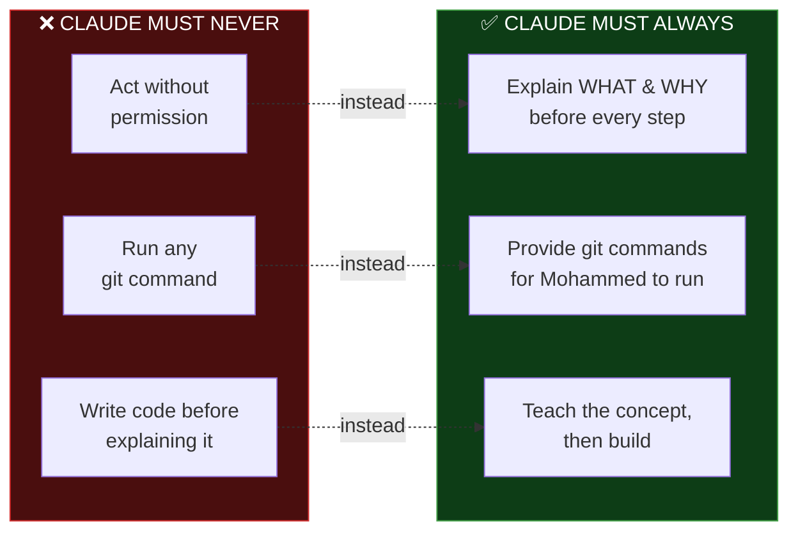

---

## 3. THE PHASE ROADMAP

```mermaid
flowchart TD
    P0["✅ PHASE 0<br/>Foundations & setup"] --> P1

    subgraph CORE["🧠 THE THINKING LAYER — pure Python, no framework"]
        P1["✅ PHASE 1 ⭐⭐<br/>Object-Oriented Programming"] --> P2["✅ PHASE 2<br/>Clean code & SOLID"]
        P2 --> P3["✅ PHASE 3<br/>Testing & TDD"]
    end

    P3 --> P4["✅ PHASE 4<br/>Databases & persistence"]

    subgraph ALGO["⚙️ THE HARD PART — real computer science"]
        P5["✅ PHASE 5<br/>Data structures: skill graph"] --> P6["✅ PHASE 6<br/>Algorithms I: intervals"]
        P6 --> P7["✅ PHASE 7 ⭐⭐<br/>Algorithms II: MATCHING ENGINE"]
    end

    P4 --> P5
    P7 --> P8["✅ PHASE 8<br/>Design patterns"]
    P8 --> P9["✅ PHASE 9<br/>Software architecture"]

    subgraph WEB["🌐 THE OUTSIDE WORLD"]
        P10["✅ PHASE 10<br/>Web & REST APIs"] --> P11["✅ PHASE 11<br/>Auth & RBAC"]
        P11 --> P12["✅ PHASE 12<br/>Money & correctness"]
        P12 --> P13["✅ PHASE 13<br/>Caching & async"]
    end

    P9 --> P10
    P13 --> P14["✅ PHASE 14<br/>Errors & logging"]
    P14 --> P15["✅ PHASE 15<br/>Security"]
    P15 --> P16["✅ PHASE 16<br/>Tooling & typing"]

    subgraph OPS["🚢 SHIPPING IT"]
        P17["✅ PHASE 17<br/>Docker"] --> P18["✅ PHASE 18<br/>CI/CD"]
        P18 --> P19["✅ PHASE 19<br/>Deployment"]
    end

    P16 --> P17
    P19 --> P20["✅ PHASE 20<br/>Frontend — only now"]
    P20 --> P21["🔄 PHASE 21<br/>Docs & showcase<br/><i>in progress</i>"]
    P21 --> DONE(["🎯 Apply to<br/>Expert Choice CIS"])

    style CORE fill:#1a237e,stroke:#5c6bc0,color:#fff
    style ALGO fill:#4a148c,stroke:#ab47bc,color:#fff
    style WEB fill:#004d40,stroke:#26a69a,color:#fff
    style OPS fill:#3e2723,stroke:#8d6e63,color:#fff
    style DONE fill:#1b5e20,stroke:#66bb6a,color:#fff
```

---

## 4. THE ARCHITECTURE & THE DEPENDENCY RULE

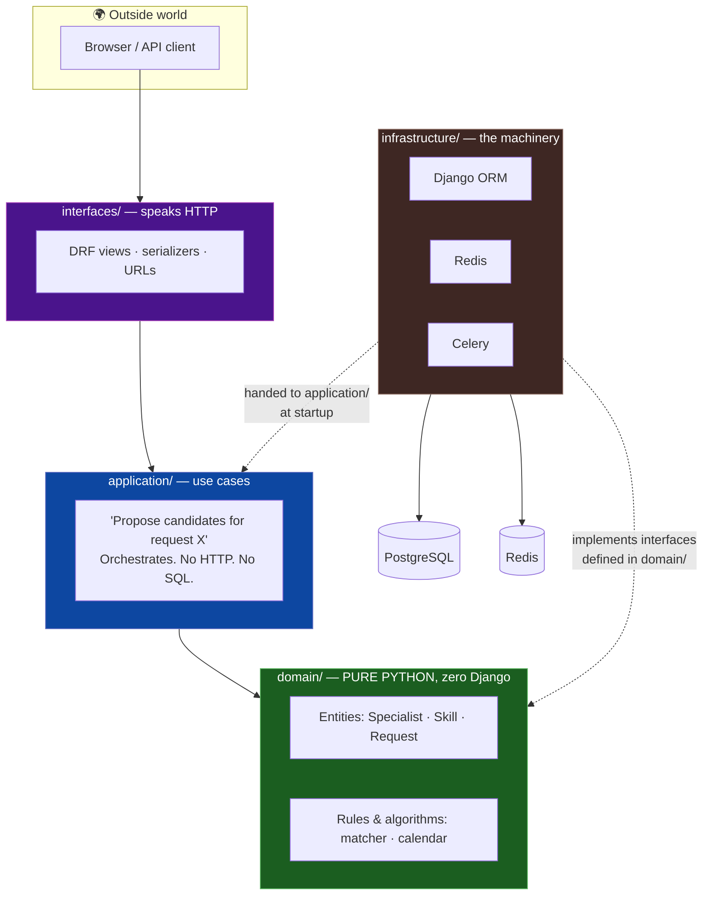

> **The dependency rule:** every solid arrow points *inward*. `domain/` imports nothing from the
> layers outside it — no Django, no database, no HTTP. That is precisely why it can be tested in
> milliseconds, and it is the single biggest architectural idea in this project.
>
> **Read the two dotted arrows carefully — they are the whole trick.** `application/` never imports
> `infrastructure/`. Instead `domain/` declares an *interface* ("something that can list all
> specialists"), `infrastructure/` writes the real Django-ORM version of it, and at startup that
> real object is **handed in** to `application/`. In tests we hand in a fake list instead and the
> exact same code runs with no database.

---

## 5. THE DOMAIN MODEL

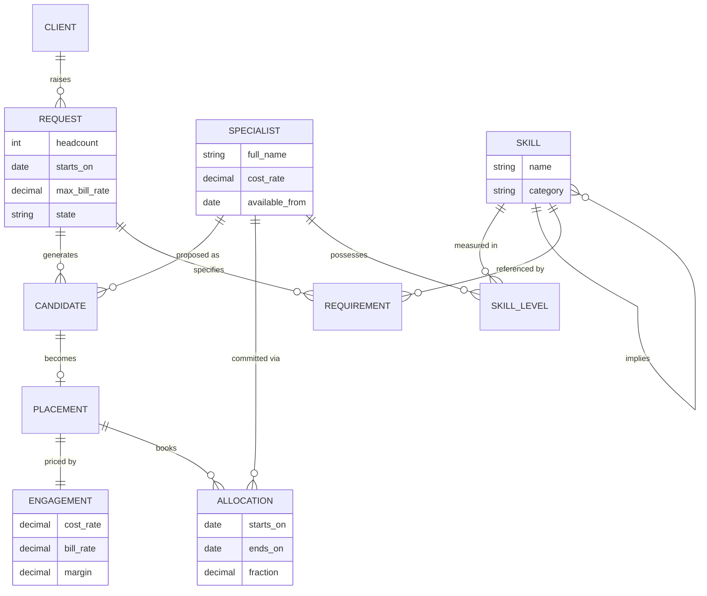

---

## 6. THE REQUEST PIPELINE — a state machine

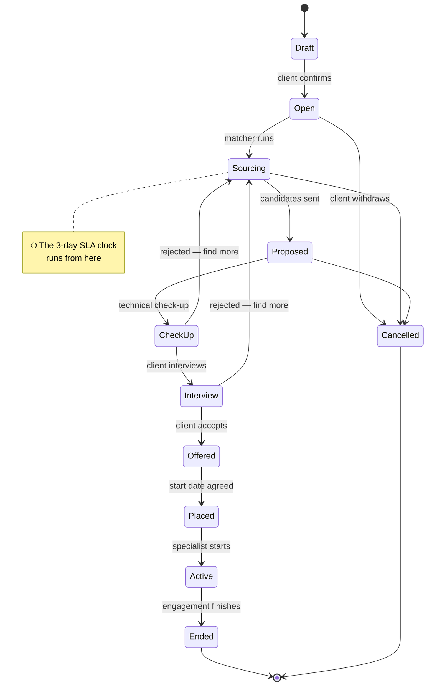

---

## 7. HOW A MATCH ACTUALLY HAPPENS

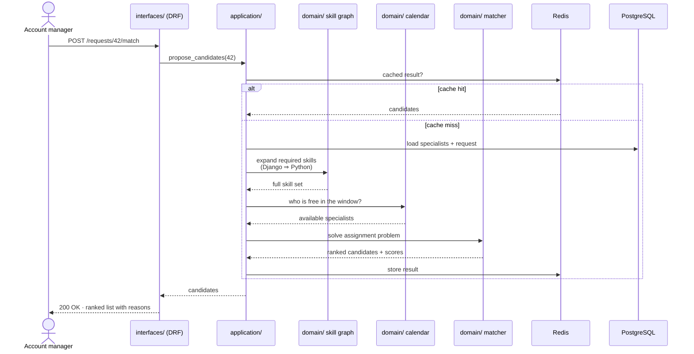

---

## 8. THE GIT WORKFLOW

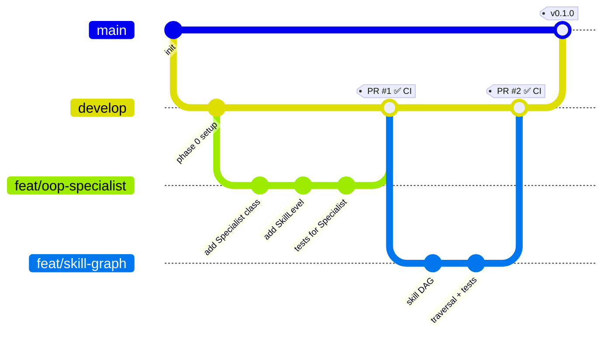

**Who does what:**

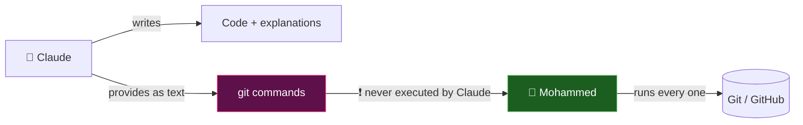

---

## 9. THE CI/CD PIPELINE *(Phase 18)*

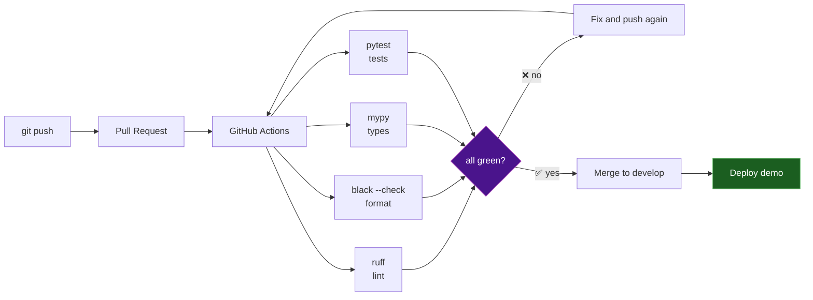

---

## 10. WHAT RUNS WHERE *(Phase 17)*

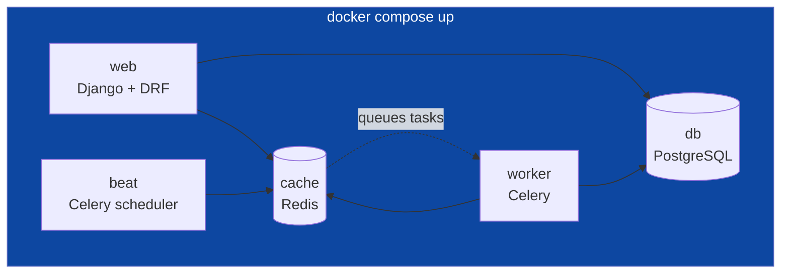

One command brings the entire system up. That is the point of Phase 17 — anyone, including an
interviewer, can run this project in under a minute.

---

## 11. CONCEPT COVERAGE MAP

Where each thing from the learning plan is actually taught:

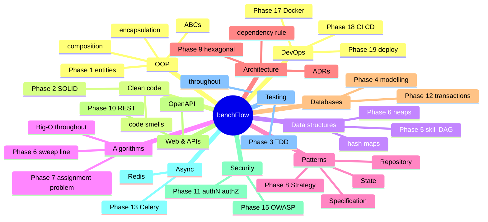

---

## 12. THE END GOAL

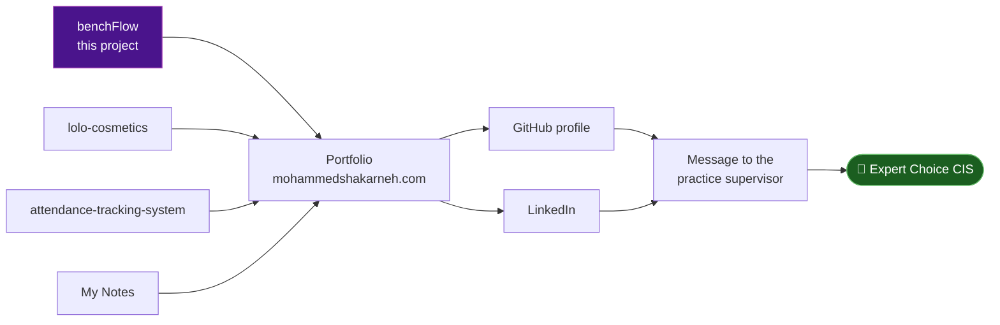
